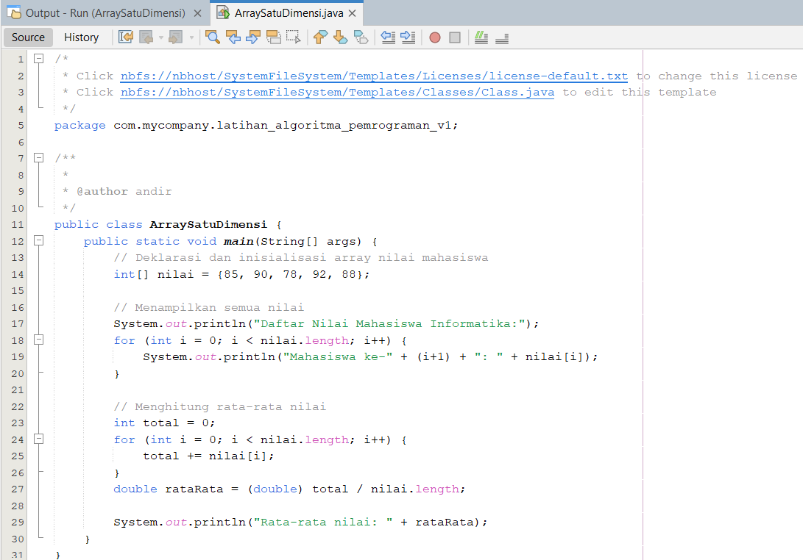
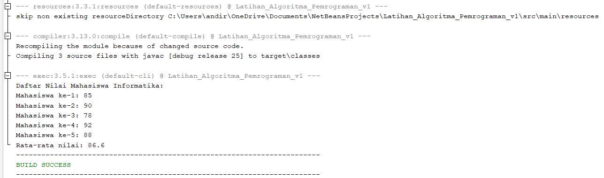

<!-- head -->
# PROGRAM ARRAY 1 DIMENSI/LARIK
<p align="left" width="300%">
        <a href="https://github.com/aramli">
                </a>
        <a href="https://github.com/whyyroot/Algoritma-Pemrograman-/blob/main/Array%201%20Dimensi%20atau%20larik/ArraySatuDimensi.java">
                </a>
        
</p>  

Penulis : Andi Ramli Hidayat
<p>
       Array 1 dimensi (larik) adalah struktur data yang digunakan untuk menyimpan sekumpulan nilai dengan tipe data yang sama dalam satu variabel. Setiap elemen array dapat diakses menggunakan indeks, yang biasanya dimulai dari 0. Array memudahkan pengelolaan data yang jumlahnya banyak, misalnya daftar nilai mahasiswa, daftar harga barang, atau daftar nama. Contoh sederhana: sebuah array nilai berisi nilai ujian mahasiswa [80, 90, 75, 85]. Dengan array, kita bisa mengakses nilai tertentu, misalnya nilai[1] menghasilkan angka 90.
</p>

## Daftar isi
1. [Program Code](#program-code)
2. [Penjelasan Code](#penjelasan-code)
3. [Dokumentasi Program](#dokumentasi-program)

<!-- content -->
## Program Code Java
```
public class ArraySatuDimensi {
    public static void main(String[] args) {
        // Deklarasi dan inisialisasi array nilai mahasiswa
        int[] nilai = {85, 90, 78, 92, 88};
        
        // Menampilkan semua nilai
        System.out.println("Daftar Nilai Mahasiswa Informatika:");
        for (int i = 0; i < nilai.length; i++) {
            System.out.println("Mahasiswa ke-" + (i+1) + ": " + nilai[i]);
        }
        
        // Menghitung rata-rata nilai
        int total = 0;
        for (int i = 0; i < nilai.length; i++) {
            total += nilai[i];
        }
        double rataRata = (double) total / nilai.length;
        
        System.out.println("Rata-rata nilai: " + rataRata);
    }
}
```
## Penjelasan Code
<li>Deklarasi Array</li>

```
// Deklarasi dan inisialisasi array nilai mahasiswa
        int[] nilai = {85, 90, 78, 92, 88};
```

 → Membuat array bertipe int dengan 5 elemen, mewakili nilai ujian mahasiswa informatika.
<br>
 <li>Perulangan for untuk menampilkan </li>
 
 ```
 for (int i = 0; i < nilai.length; i++) {
            System.out.println("Mahasiswa ke-" + (i+1) + ": " + nilai[i]);
        }
 ```

 → Looping digunakan untuk menampilkan setiap nilai mahasiswa berdasarkan indeks array.

<br>
 <li>Perulangan for untuk menampilkan </li>
 
```
 int total = 0;
        for (int i = 0; i < nilai.length; i++) {
            total += nilai[i];
        }
```

→ Menjumlahkan semua nilai mahasiswa.

<br>
 <li>Menghitung Rata Rata</li>
 
```
double rataRata = (double) total / nilai.length;
```

→ Total nilai dibagi jumlah elemen array, hasilnya disimpan dalam variabel rataRata.

## Dokumentasi Program
 
 
<!--footer -->
<p align="center" width="300%">
        GO TO PAGE<br>
        <a href="https://github.com/whyyroot/Algoritma-Pemrograman-/tree/main/Bangun%20Ruang">
              </a> 
        <a href="https://github.com/whyyroot/Algoritma-Pemrograman-/tree/main/Array%202%20Dimensi%20atau%20larik">
              </a>
</p>
