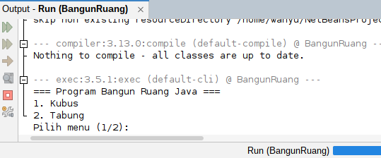
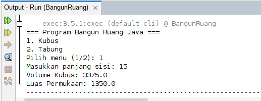
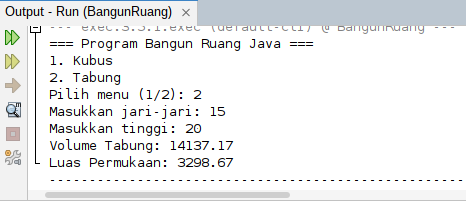

# PROGRAM BANGUN RUANG
<p align="left" width="300%">
        <a href="https://github.com/whyyroot">
                </a>
        <a href="https://github.com/whyyroot/Algoritma-Pemrograman-/blob/main/Bangun%20Ruang/BangunRuang/src/main/java/com/mycompany/bangunruang/BangunRuang.java">
                </a>
        
</p>  

Penulis : Irvan Wahyudin  
Program ini adalah untuk menghitung bangun ruang dengan bahasa java.

## Daftar isi
1. [Program Code](#program-code)
2. [Ringkasan Program](#ringkasan-program)
3. [Dokumentasi Program](#dokumentasi-program)

## Program Code Java
```
public class BangunRuang {
        public static void main(String[] args) {
            Scanner input = new Scanner(System.in);

            System.out.println("=== Program Bangun Ruang Dengan Java ===");
            System.out.println("1. Kubus");
            System.out.println("2. Tabung");
            System.out.print("Pilih menu (1/2): ");
            int pilihan = input.nextInt();

            if (pilihan == 1) {
                System.out.print("Masukkan panjang sisi: ");
                double s = input.nextDouble();
           
                double volume = Math.pow(s, 3);
                double luas = 6 * Math.pow(s, 2);

                System.out.println("Volume Kubus: " + volume);
                System.out.println("Luas Permukaan: " + luas);

            } else if (pilihan == 2) {
                System.out.print("Masukkan jari-jari: ");
                double r = input.nextDouble();
                System.out.print("Masukkan tinggi: ");
                double t = input.nextDouble();

                double volume = Math.PI * Math.pow(r, 2) * t;
                double luas = 2 * Math.PI * r * (r + t);

                System.out.printf("Volume Tabung: %.2f\n", volume);
                System.out.printf("Luas Permukaan: %.2f\n", luas);
            } else {
                System.out.println("Pilihan tidak tersedia.");
            }

            input.close();
        }
    
}
```

## Penjelasan Code
```
import java.util.Scanner;
```
- Ini untuk memangil "alat" bernama scanner, jadi agar java bisa mendengar dan membaca apa yang kita ketik atau input di keyboard, kita membutuhkan alat Scanner ini.

```
public class BangunRuang {
        public static void main(String[] args) {
```
- `public class ...` adalah program kita. Dijava, nama file harus sama denan nama class ini jika tidak, tidak akan jalan.
- `public static ...` adalah pintu masuk. Artinya komputer mencari barisan ini dan pertama kali yang akan dijalankan.  

```
Scanner input = new Scanner(System.in);
```
- Jadi code ini kita membuat sebuah objek bernama input dan sekarang jika kita ingin mengambil data dari keyboard, cukup panggil si input saja.

```
System.out.println("=== Program Bangun Ruang Dengan Java ===");
System.out.println("1. Kubus");
System.out.println("2. Tabung");
System.out.print("Pilih menu (1/2): ");
int pilihan = input.nextInt();
```
- `System.out.println` adalah perintah untuk menampilkan text ke layar
- `int pilihan = input.nextInt();` adalah perintah input jadi perogram akan menunggu kamu memasukan angka int dan akan di simpan di variabel pilihan.

```
if (pilihan == 1) {
...
} else if (pilihan == 2) {
...
} else {
...
}
```
- Jadi ini adalah menentukan kondisi yang kita input, jadi jika kita menginputkan 1, program akan menjalankan code didalam kurung begitupun jika memilih/menginputkan 2.
- Dan jika user tidak menginputkan 1/2 program akan menjalankan code yang ada di else.

```
double s = input.nextDouble();
           
double volume = Math.pow(s, 3);
double luas = 6 * Math.pow(s, 2);

/***and
***/

double volume = Math.PI * Math.pow(r, 2) * t;
double luas = 2 * Math.PI * r * (r + t);
```
ini adalah bagian ininya yaitu rumus matematika
- `double` jadi kita mendeskripsikan atau mengitng dengan angka yang ada komanya(decimal).
- `Math.PI` adalah cara memanggil angka 3.13159... tanpa harus mengetik manual.
- `Math.paw ...` artinya $r$ pangkat 2 ($r^2$), jika ingin pangkat 3/lainya tinggal diganti angka setelah variabel.

```
System.out.printf("Volume Tabung: %.2f\n", volume
System.out.printf("Luas Permukaan: %.2f\n", luas);
```
- `printf` artinya Print Formatted. jadi kita bisa menampilkan sesuai format yang kita ingingkan.
- `%.2f` ini adalah kode untuk menampilkan 2 angka di belakang koma.
- dan `/n` adalah perintah membuat baris baru (enter).

## Ringkasan Program
1. Program berinteraksi dengan pengguna, program akan meminta input dari pengguna.
2. Struktur pengambilan keputusanya menggunakan if-else.
3. Perhitunganya menggunakan library Math.
4. Menampilkan hasil dengan Formatting.

## Dokumentasi Program
  

<p align="center" width="300%"><a href="https://github.com/whyyroot/Algoritma-Pemrograman-/tree/main/Array%201%20Dimensi%20atau%20larik"></a> <a href="https://github.com/whyyroot/Algoritma-Pemrograman-/tree/main/Array%202%20Dimensi%20atau%20larik"></a>
</p>

